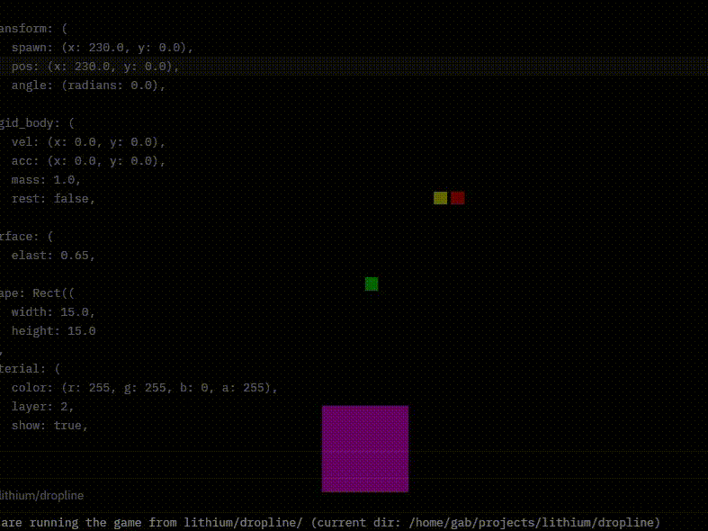

<div align="center">

# 🎮 lithium-engine 🦀


*lightweight and minimal Rust game engine with a game included*

</div>

---

### ℹ️ About

This repository contains:
- **lithium-engine** → library crate, the actual game engine
- **dropline** → binary crate, an example of a game developed with lithium-engine

**⚠️ Work in progress: APIs and features may change rapidly.**

---

### 📦 Requirements

- [Rust](https://www.rust-lang.org/tools/install) (latest stable recommended)
- Linux (tested), Windows (tested), macOS (untested but should work)

---

### 🚀 Installation and execution

Clone the repository, cd into dropline and run the example game:

```bash
git clone https://github.com/gabvigano/lithium.git
cd lithium/dropline
cargo run
```

---

### 🎥 Demo



---

### 🤝 Contributing

See [CONTRIBUTING.md](./CONTRIBUTING.md). Any help is really appreciated!

---

### 📜 Licensing

See [LICENSE.md](./LICENSE.md).
